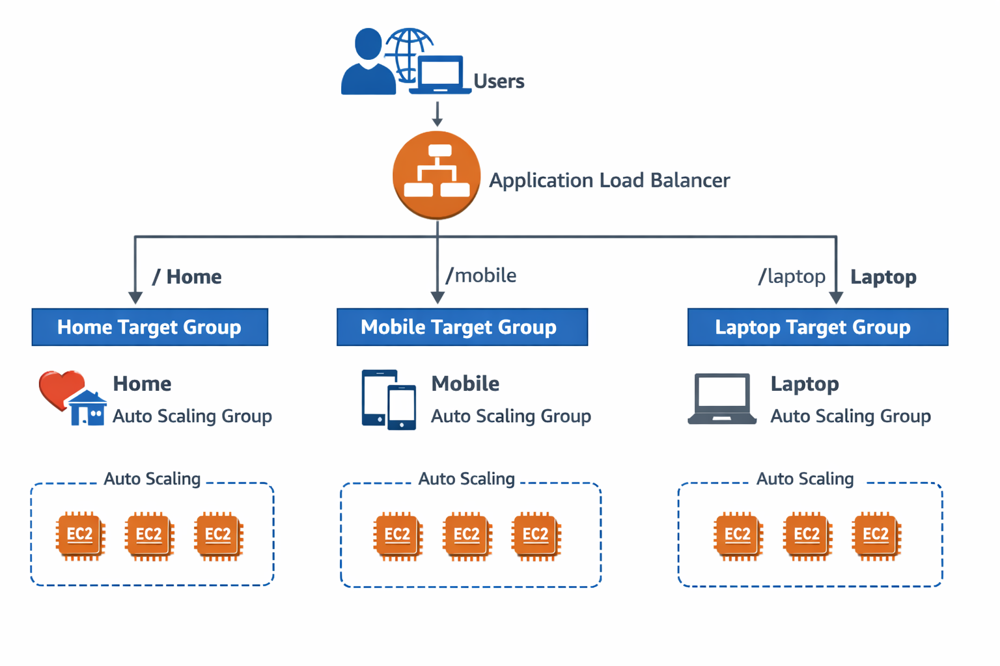
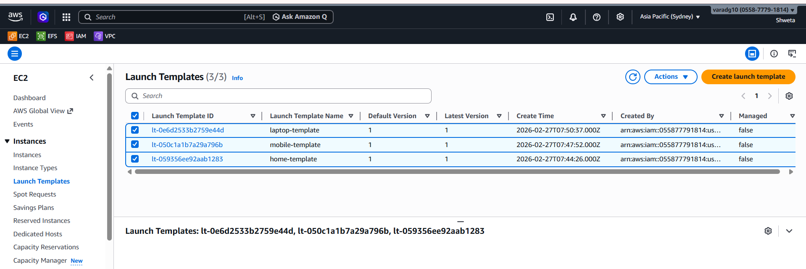
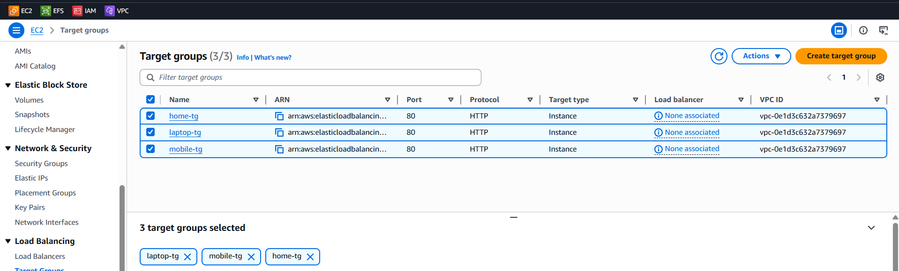
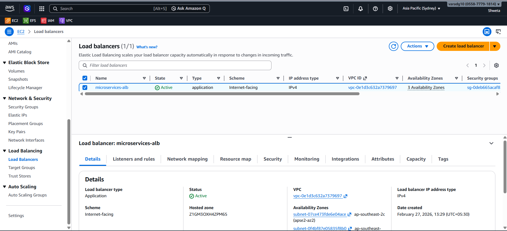
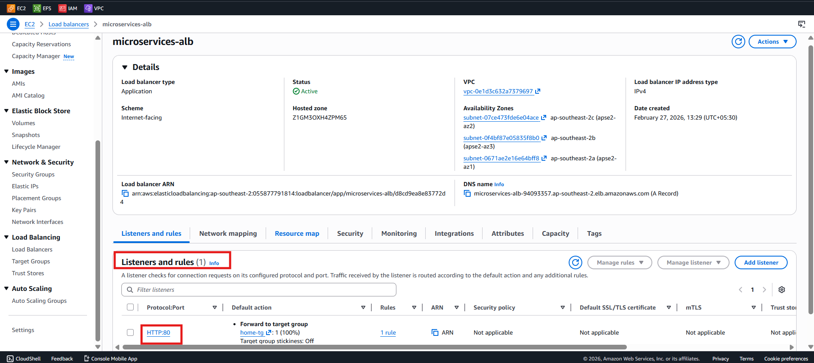
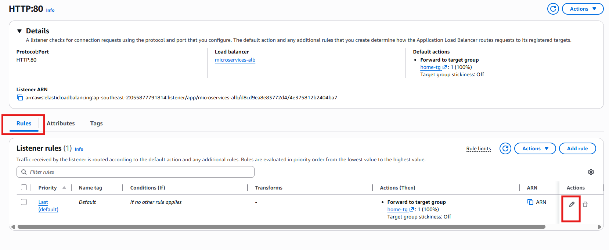
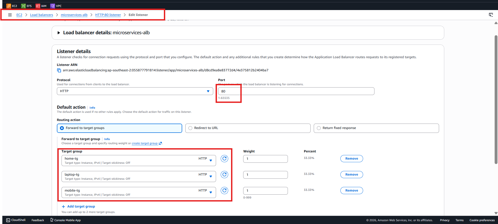
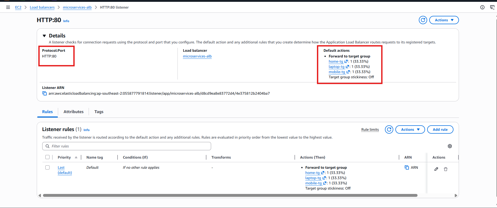

# AWS Microservices Architecture using ALB & Auto Scaling

## 📌 Project Overview

This project demonstrates a production-style microservices architecture built on Amazon Web Services (AWS).

The architecture consists of three independent microservices:

- Home Service
- Mobile Service
- Laptop Service

Each service is deployed using Launch Templates and managed by independent Auto Scaling Groups. Traffic is routed through a single Application Load Balancer using path-based routing.

---

## 🏗 Architecture Design

User → Application Load Balancer → Target Groups → Auto Scaling Groups → EC2 Instances

Routing Logic:

- / → Home Service
- /mobile → Mobile Service
- /laptop → Laptop Service

Each microservice scales independently based on CPU utilization.

  

---

## ⚙ Implementation Steps

1. Created 3 Launch Templates (Home, Mobile, Laptop)
2. Created 3 Target Groups
3. Created 1 Application Load Balancer
4. Created 3 Auto Scaling Groups
5. Configured path-based routing rules
6. Performed stress testing manually

---

## 🛠 AWS Services Used

### Amazon EC2
Used to run web servers (Apache installed via user data script).

### Launch Templates
Defines instance configuration including:
- AMI
- Instance type
- Security group
- User data script

  

### Target Groups
- Performs health checks
- Routes traffic only to healthy instances

  

### Application Load Balancer
- Operates at Layer 7 (HTTP/HTTPS)
- Supports path-based routing
- Distributes traffic across multiple AZs

  

### Auto Scaling Groups
- Maintains desired, min & max capacity
- Performs self-healing
- Scales instances based on CPU utilization after 30% as we set in target tracking policy

  

### 🔀 Path-Based Routing Configuration

- The Application Load Balancer receives all incoming traffic on **Port 80 (HTTP)**.
- Configured a listener on **Port 80** to handle incoming web traffic.
- Each microservice is mapped to its own Target Group.
- Defined path-based routing rules in the ALB listener:
- steps

#### Listener Rules Screenshot

  

  

  

  

---

## 🔥 Auto Scaling Validation

- Installed stress tool on EC2
- Generated high CPU load
- Observed scaling activity in Auto Scaling Group
- Verified new instance launch

Scaling is based on average CPU utilization across the Auto Scaling Group.

---

## ♻ Self-Healing Validation

- Stopped Apache service on one instance
- Target Group marked instance as unhealthy
- Auto Scaling Group terminated and replaced the instance automatically

---

## 📊 Key Concepts Learned

- Difference between scaling and self-healing
- Average CPU utilization in Auto Scaling
- Path-based routing using ALB
- Independent scaling for microservices
- Importance of min, desired, and max capacity settings

---

## 🚀 Production Features Implemented

- High Availability (Multi-AZ)
- Load Balancing
- Independent Horizontal Scaling
- Health Monitoring
- Fault Tolerance

---

---

## 🔮 Future Improvements

- Add HTTPS using ACM
- Implement Infrastructure as Code (Terraform)
- Add CloudWatch Alarms & SNS Notifications
- Implement CI/CD pipeline

---

## 👩‍💻 Author

Shweta Bhore  
DevOps & Cloud Enthusiast